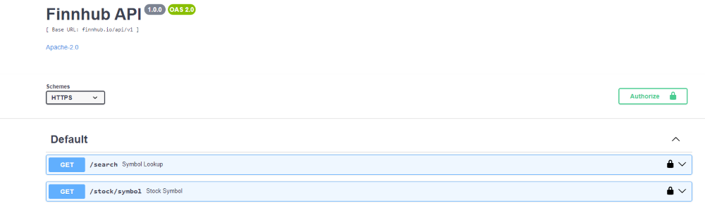

# Dashboard-distributed app for stock data using Angular and a Python based backend

## Structure on disk

### The app
Sources, configurations and docs are locate in the app folder

### The service infrastructure
The application (both in dev and prod) runs from Docker containers.
The infrastructure is defined in the deploy folder yml and docker files.  

**Note**:
- for the first project setup (no files exist yet on drive and no commit has been made in Git) please use the initial_setup.bash to run an automated setup.

## Functionality

### Authentication

A silent authentication will sign the user in and assign an API token to connect to the data provider.
Currently this is limited but can easily be extended to a full auth service, providing JWTs and full auth features.

### Dashboards

The database boots with a set of test dashboards .
The user can also create their own dashboards. 
The user can also edit and remove any dashboards.

### Data

Data is currently set to maximum sampling rate allowed on the provider side (i.e. 1 minute data resolution).
The graphs display the closing values over the 1 minute interval for the selected stock-symbols.

Special scenario: Sundays, the API provider has no data over the past 24h, in ths case, the app will extend the interval it samples on
by 24h  steps, until it finds data to display (max of 3 days).

### Mobile first 
We mostly design around the width as the main limiting factor (for grouping, font size, UI elements sizes, ..).

Considering current statistics we have 2 major categories:
- smallest screen width still in signifficant use: 360px width (height 780px-800px)
- most common width still used in 2023: 390px (height 844)

Used sites:
- https://worship.agency/mobile-screen-sizes-for-2023-based-on-data-from-2022
- https://gs.statcounter.com/screen-resolution-stats/mobile/worldwide

## Libraries and build tools

We use bootstrap and Angular Material as a styling librares.   
We use NodeJs to serve the app during development and provide the build toolchain.  
We use Nginx to serve the app in production. Nginx is also used as Ingress solution to our backend.

The documentation and diagrams are created using drawio (a VSCode plugin exists as well as a standalone app).

## Data provider: Finnhub api
The online data is produced by the finnhub.io provided REST apis.
Our backend will redirect requests to the finnhub.io api.

### Finnhub Authentication
Authentication is required for all requests sent to the API.
The Authentication is provided in the form of a per-user token (api-key).  
This is obtained on the Frontend as part of a successful authentication to our backend.

**Note**:
- It may have previously possible to generate a token programmaticaly but there is no longer an API providing this functionality.

### Documentation
Api documentation is provided in HTML format: https://finnhub.io/docs/api.

### Swagger api docs
It is also available in Swagger format (allowing diret tests after authentication): https://finnhub.io/static/swagger.json.  
To inspect it, use the online editor provided at: https://editor.swagger.io/ and load the json format swagger API (alternatively an editor can be set up locally).  
This allows a closer inspection of the API as well as manually testing it.

## Running the app

### Dev mode

From the deploy folder: 

        docker compose --profile dev up

### Production

Production images have the functionality built in. 

Note:
You can still bind to the src folders to be able to edit the sources for testing and debugging. To enable this, you can use the dev docker compose yml as an example.

The frontend is reduced to optimized static files and served through an Nginx container. 

Note:
The Nginx container uses Alpine Linux, to optimize for size, so you will need to use sh instead of bash to execute into the container during runtime.

To run the production deployment:
- use the deploy/production folder
- run with docker compose --profile prod up.
