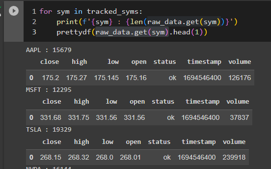
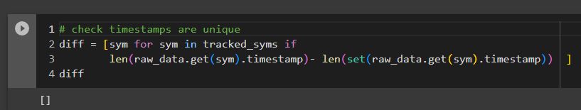
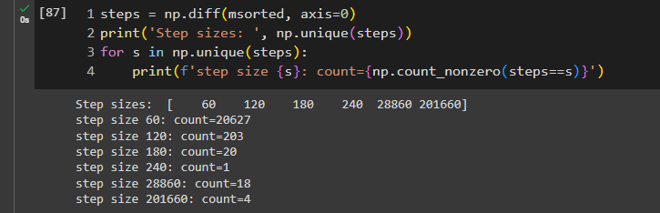
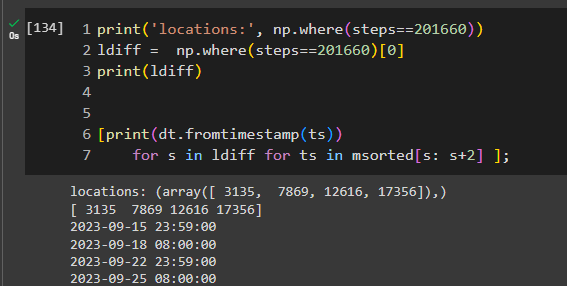
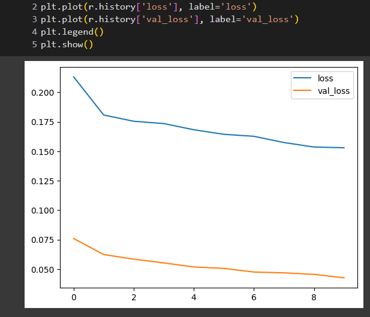

# Forecasting

- see Colab notebook for analysis details and code : https://colab.research.google.com/drive/1fu2YAWgXiQyEkUHabxrSh73BV5gjpMFk#scrollTo=JqNoUw0OGx3u&uniqifier=1

# General points

## Defining the main goal

The main goal is to have predictions possible for a configurable number of steps in the future and for a given stock.

The predictions are of return values (i.e. the increase in percentage in the values at close ).

The steps should be configurable with the remark that prediction quality will llikely worsen the further in the future we try to predict.

#### Design choice
The model will attempt to predict on single stock symbols only (i.e. will will not consider possible inter-symbol correlations).\
This comes from the way we sample data on the frontend , to keep the logic simple. \
Alternatives would be to buffer or synchronize requests before running a model on them or have the process running in the background for all symbols.

## Model integration
We will use a suitable Time Series model that will export the predictions in a specific format.\
This is so we can switch the model based on performance.

## Model training

We cannot find a free model pre-trained on the specific data we have. \
To train a model from scratch we will pull data from the finnhub provider for the max available time interval.\
We will only use 10 stocks as a proof-of concept. Doing all the available stocks is a simple extension of the concept but it would result in much larger training datasets and necessary time.

## Model type

We will start with a generic LSTM model. \
At a second stage, the model can be exchange for more powerfull Transformer based models or model compositions.

# Data and training

## Available data shape

We use the candle data api which provides as follows, given a time interval and a resolution for the data sampling.

Given:
- interval = [startTimestamp, endTimestamp]
- resolution = 1 min (max supported resolution for the api). i.e they sample data from the stock markets at this sampling rate

We receive the following structure:
- 'o' - opening value at the start of the candle interval
- 'h' - highest value observed during the candle interval
- 'l' - lowest value observed during the candle interval
- 'c' - closing value for the candle interval
- 'v' - volume of transacted stocks during the interval
- 't' - timestamp as a unixTimestamp (see https://www.unixtimestamp.com/) for the sampled values

## Dataset construct

We will consider the use case of predicting over single-stock candle data.

As such we will stack the data we have for the different symbols and we can fit the model iteratively over all of them.

The normalization phase also needs to fit the scaler model over as much of the symbols as possible (due to variation in sizes).

We will define the features vector as a sample vector of received data (including the closing prices).

We will have a time series prediction, meaning our model will attempt to predict the next feature vector for the next point in time. 

We will also use only 10 stocks for the predictions to limit the size of the dataset and the model training duration.

## Some Challenges

### Different sample times for the different stocks
Filling missing data with suitable values (ex. gaps in sampled data for a single stock).\
We can observe the data is not synchronized over the stocks, i.e. note the varied sizes of data pulled for the same time intervals:

Testing if the timestamps are unique shows this is true:

### Solution

A quick solution is to normalize the timestamp values (set a step size) and fill in any missing values with the last values (from the previous sampling).

To do this we will use merge sorting over the timestamp value sets to construct a complete set (unique values) of timestamps.
Note:
 - merge sorting is O (nlogn) and it seems most python libraries provide a sort with this performance. We'll take numpy since it will be used later as well. Numpy requires a concatenation (O(1)) followed by a sort (O(nlogn))

### Data gaps analysis

We see that step sizes are irregular over the merged timestamp vector:

Analysis shows the following.
We see that data gaps appear in 2 situations:
- 8h gaps: daily between 24.00 and 8.00 the next day
- 56h gaps: over each weekend from Friday 24:00 to Monday 8.00
- 120s and 180s: Smaller gaps are simply intervals where no data was sampled (constant data) for any of the monitored stocks.

Example for the 56h gap:

#### Solution
Since these gaps are across all stocks we can simply consider the data within these intervals as constant.
An alternative to explore would be to cut out these intervals completely .

# Model

We use a generic LSTM model which we will train with time series data.\
The model is stored and can be further trained or simply loaded and used as is.

## Scaler
The same as for the model applies to the pre-trained scaler: it is saved and loadable on a backend service.

## Training

We only train the model for 10 epochs. \
The observation is that around 10 epochs the loss decrease seems to taper-off so training for longer on this amount of data is not likely to improve the performance.

## Predictions

We first have a look on how well a model is able to predict the next value in a sequence.
We use a 50 elements window and a set of 5 features taken for a "generic" stock symbol.

Looking at the results we see that the model does decrease the loss by a small margin(aka it's learning) this is also decreasing the loss on the validation data. 

The remark to make here is that this is a single step prediction measure taken during the learning phase. 
The real challenge comes from multistep predictions that would allow time to also act on te findings.

